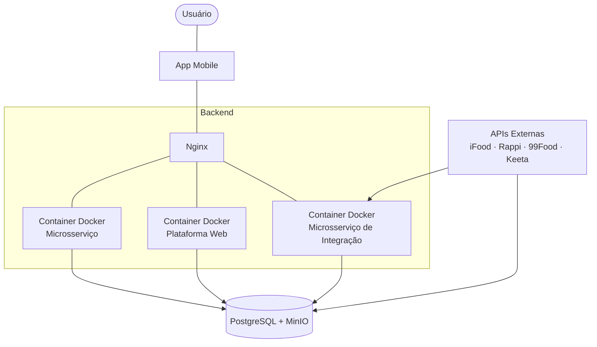

# Gerôncio

**Gerenciamento automático de estoque, pedidos e entregas para restaurantes.**

Restaurantes pequenos e médios recebem pedidos por vários canais ao mesmo tempo (iFood, Rappi, 99Food, Keeta, WhatsApp, balcão) e precisam conciliar tudo na mão. O Gerôncio centraliza esses canais em um painel único, mantém o estoque sincronizado automaticamente e organiza a operação de entrega.

> Projeto da disciplina de Engenharia de Software — UNIFESP.

---

## O problema e a solução

| Problema observado | Solução proposta |
| --- | --- |
| Múltiplas entradas de pedidos | **Painel único** — todos os canais em uma só tela |
| Atualização manual de estoque | **Atualização automática** — a baixa se propaga para todas as plataformas conectadas |
| Entregas demoradas | **Gestão de entregas e rotas** — alocação por proximidade real e frete por rota |
| Falta de visão da operação | **Controle e relatórios** — estatísticas e gráficos de vendas |
| Clientes insatisfeitos | **Clientes fidelizados** — entrega mais rápida, preço justo e acompanhamento |

### Painel único e atualização automática

Um sistema central de gerenciamento de estoque. Ao dar baixa em um item (por venda ou ajuste manual), o sistema propaga automaticamente a atualização para todas as plataformas de delivery conectadas — sem precisar abrir um app de cada vez.

### Gestão de entregas e rotas

Dois problemas concretos são atacados aqui:

1. **Alocação manual de entregadores.** Hoje a distribuição dos pedidos é feita sem lógica de proximidade real, então entregas próximas umas das outras acabam desperdiçadas — o que aumenta custo e tempo. O Gerôncio **sugere automaticamente qual entregador deve atender um novo pedido**, com base na proximidade real entre a localização atual do entregador (ou sua rota em andamento) e o novo endereço.

2. **Frete calculado em linha reta.** Plataformas como o "Anota Aí" calculam o frete pelo raio entre estabelecimento e cliente, não pela rota percorrida. Ruas, mão única e obstáculos geográficos fazem a distância real ser maior, e a diferença é absorvida pelo restaurante. A solução usa a **API do Google Maps para calcular a distância real da rota**, de forma que o frete reflita o custo real do deslocamento.

### Controle e relatórios

Estatísticas dos pedidos, análise de demanda local com aviso ao restaurante e gráficos de vendas: aplicativos que mais vendem, pratos mais pedidos e dias mais movimentados.

---

## Público-alvo

- **Principal:** pequenos e médios restaurantes com 2 ou mais entregadores próprios.
- **Secundário:** outros estabelecimentos que usam múltiplos canais de delivery (farmácias, papelarias, atacados etc.).

---

## Telas

| Tela | O que mostra |
| --- | --- |
| **Início** | Resumo da semana: avaliações de clientes e ranking de produtos mais vendidos |
| **Pedidos** | Pedidos recebidos por canal, com entregador designado, endereço, frete e total |
| **Estoque** | Quantidade disponível por produto, com ajuste manual e cadastro/remoção de itens |
| **Vendas** | Gráficos de vendas por dia da semana/mês e distribuição por produto |

---

## Stack

| Camada | Tecnologia |
| --- | --- |
| Frontend | React Native + Expo (expo-router, TypeScript) |
| Backend | Express.js |
| Banco de dados | PostgreSQL (+ MinIO para objetos) |
| Infraestrutura | Docker + Kubernetes + Nginx |
| Integrações | APIs de delivery (iFood, Rappi, 99Food, Keeta) e Google Maps |

## Arquitetura



O Nginx faz o roteamento das requisições para os microsserviços em containers Docker. O microsserviço de integração é quem conversa com as APIs das plataformas de delivery, recebendo pedidos e propagando as atualizações de estoque.

---

## Estrutura do repositório

```
.
├── frontend/        # App React Native + Expo (rotas em src/app)
├── backend/         # API Express.js
├── docs/            # Pitch e documentação do projeto
└── package.json     # Workspace raiz (pnpm)
```

## Como rodar

Pré-requisitos: **Node.js** e **pnpm**.

```bash
# instalar dependências
pnpm install

# iniciar o app (Expo)
pnpm dev
```

O Expo abre o menu com as opções de execução: build de desenvolvimento, emulador Android, simulador iOS, Expo Go ou navegador. Dentro de `frontend/` também estão disponíveis `pnpm android`, `pnpm ios`, `pnpm web` e `pnpm lint`.

> **Status:** o frontend está em desenvolvimento e o backend ainda não foi implementado — `backend/` contém apenas a configuração inicial do pacote.

---

## Equipe

- Felipe Freitas D'Elia
- Gabriel Fraga de Souza Ribeiro
- João Pedro Navarro Okita
- João Pedro Soldera Snabaitis Markues
- João Pedro Uezu da Luz
- Leonardo José de Castro Carvalho
- Lucas Gonzaga Prado
- Matheus Cahú Monteiro dos Santos

## Documentação

- [Pitch do projeto](docs/Eng.%20Software%20-%20PITCH.pdf)
